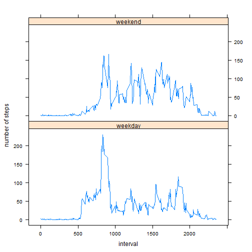

## Loading and preprocessing the data
I use dplyr and tidyr to manipulate data and lattice for last graphic


```r
library(dplyr)
library(tidyr)
library(lattice)
```


### 1. Load the data (i.e. read.csv())

Loading data (file activity/activity.csv should be in working directory) in activity_ds variable


```r
activity_ds <- read.csv('activity/activity.csv', sep = ',')
```

### 2. Process/transform the data (if necessary) into a format suitable for your analysis

Preprocessing the data, date column is factor, mutate it to date format


```r
activity_ds <- mutate(activity_ds, date = as.Date(activity_ds$date, format='%Y-%m-%d'))
```

Let's summarize the data set


```r
summary(activity_ds)
```

```
##      steps             date               interval     
##  Min.   :  0.00   Min.   :2012-10-01   Min.   :   0.0  
##  1st Qu.:  0.00   1st Qu.:2012-10-16   1st Qu.: 588.8  
##  Median :  0.00   Median :2012-10-31   Median :1177.5  
##  Mean   : 37.38   Mean   :2012-10-31   Mean   :1177.5  
##  3rd Qu.: 12.00   3rd Qu.:2012-11-15   3rd Qu.:1766.2  
##  Max.   :806.00   Max.   :2012-11-30   Max.   :2355.0  
##  NA's   :2304
```


## What is mean total number of steps taken per day?

### 1. Calculate the total number of steps taken per day

Let's group the number of steps by date, summing them


```r
grp_by_date <- group_by(activity_ds, date)

sum_steps_by_date <- summarize(grp_by_date, steps =sum(steps))
sum_steps_by_date
```

```
## Source: local data frame [61 x 2]
## 
##          date steps
## 1  2012-10-01    NA
## 2  2012-10-02   126
## 3  2012-10-03 11352
## 4  2012-10-04 12116
## 5  2012-10-05 13294
## 6  2012-10-06 15420
## 7  2012-10-07 11015
## 8  2012-10-08    NA
## 9  2012-10-09 12811
## 10 2012-10-10  9900
## ..        ...   ...
```

### 2. Make a histogram of the total number of steps taken each day

Now, let's have a look of the distribution of number of steps per day with an histogram
I chose number of breaks=5 to see clearlier the shape of the distribution


```r
hist(sum_steps_by_date$steps, xlab = "total number of steps taken each day", main="Histogram of the total number of steps taken each day", breaks=5)
```

 

### 3. Calculate and report the mean and median of the total number of steps taken per day


```r
summary(sum_steps_by_date$steps)
```

```
##    Min. 1st Qu.  Median    Mean 3rd Qu.    Max.    NA's 
##      41    8841   10760   10770   13290   21190       8
```

Mean of steps taken per day : 10770

Median of steps taken per day : 10760


## What is the average daily activity pattern?

Group the activity data set by interval, meaning the steps accross all days


```r
grp_by_interval <- group_by(activity_ds, interval)
mean_steps_by_interval <- summarize(grp_by_interval, steps =mean(steps, na.rm = TRUE))
summary(mean_steps_by_interval)
```

```
##     interval          steps        
##  Min.   :   0.0   Min.   :  0.000  
##  1st Qu.: 588.8   1st Qu.:  2.486  
##  Median :1177.5   Median : 34.113  
##  Mean   :1177.5   Mean   : 37.383  
##  3rd Qu.:1766.2   3rd Qu.: 52.835  
##  Max.   :2355.0   Max.   :206.170
```

Here we plot the time series, to see if there is a daily pattern

### 1. Make a time series plot (i.e. type = "l") of the 5-minute interval (x-axis) and the average number of steps taken, averaged across all days (y-axis)


```r
plot(type="l", y=mean_steps_by_interval$steps, x=mean_steps_by_interval$interval)
```

 

### 2. Which 5-minute interval, on average across all the days in the dataset, contains the maximum number of steps?


```r
mean_steps_by_interval[mean_steps_by_interval$steps==max(mean_steps_by_interval$steps),]
```

```
## Source: local data frame [1 x 2]
## 
##   interval    steps
## 1      835 206.1698
```

So the 5-minute interval is the interval 835


## Imputing missing values

### 1. Calculate and report the total number of missing values in the dataset (i.e. the total number of rows with NAs)

We detect which row is NA in steps column, then we just have to sum (TRUE=1, FALSE=0) the value of this boolean vector.


```r
sum(is.na(activity_ds$steps))
```

```
## [1] 2304
```

### 2. Devise a strategy for filling in all of the missing values in the dataset. The strategy does not need to be sophisticated. For example, you could use the mean/median for that day, or the mean for that 5-minute interval, etc.

I will fill in the missing value with mean for the 5-minute interval (across all days) linked to this missing value.


### 3. Create a new dataset that is equal to the original dataset but with the missing data filled in.


```r
activity_ds_with_filled_na <- activity_ds
#link steps values and steps mean values for a given interval
activity_ds_with_filled_na <- merge(x=activity_ds_with_filled_na, y=mean_steps_by_interval, by.x="interval", by.y="interval")
#fill in na values with mean value for this interval(steps.y), leave orginal step value if non na value (step.x)
activity_ds_with_filled_na <- mutate(activity_ds_with_filled_na, steps.x = ifelse(is.na(steps.x), steps.y, steps.x))
#change column names to be clearer
activity_ds_with_filled_na <- select(activity_ds_with_filled_na, date = date, steps = steps.x, interval = interval)
summary(activity_ds_with_filled_na)
```

```
##       date                steps           interval     
##  Min.   :2012-10-01   Min.   :  0.00   Min.   :   0.0  
##  1st Qu.:2012-10-16   1st Qu.:  0.00   1st Qu.: 588.8  
##  Median :2012-10-31   Median :  0.00   Median :1177.5  
##  Mean   :2012-10-31   Mean   : 37.38   Mean   :1177.5  
##  3rd Qu.:2012-11-15   3rd Qu.: 27.00   3rd Qu.:1766.2  
##  Max.   :2012-11-30   Max.   :806.00   Max.   :2355.0
```

### 4. Make a histogram of the total number of steps taken each day and Calculate and report the mean and median total number of steps taken per day. Do these values differ from the estimates from the first part of the assignment? What is the impact of imputing missing data on the estimates of the total daily number of steps?

### 4.a Make a histogram of the total number of steps taken each day

```r
grp_by_date_with_filled_na <- group_by(activity_ds_with_filled_na, date)

sum_steps_by_date_with_filled_na <- summarize(grp_by_date_with_filled_na, steps =sum(steps))

hist(sum_steps_by_date_with_filled_na$steps, xlab = "total number of steps taken each day", main="Histogram of the total number of steps taken each day with filled NA", breaks=5)
```

 

### 4.b Calculate and report the mean and median total number of steps taken per day

```r
summary(sum_steps_by_date_with_filled_na$steps)
```

```
##    Min. 1st Qu.  Median    Mean 3rd Qu.    Max. 
##      41    9819   10770   10770   12810   21190
```

### 4.c  Do these values differ from the estimates from the first part of the assignment?
- The mean is 10770 which is the same than without imputing missing data with mean

- The median is 10770 which is the same as the mean, that means that the distribution is focused arround the mean.

### 4.d What is the impact of imputing missing data on the estimates of the total daily number of steps?

The impact of imputing missing data is that increases estimates of the total daily number of steps arround the mean.

## Are there differences in activity patterns between weekdays and weekends?

### 1. Create a new factor variable in the dataset with two levels - "weekday" and "weekend" indicating whether a given date is a weekday or weekend day.


```r
#can't set saturday or sunday as the code could be run in non english spoken country, so get saturday and sunday from known dates
#"2015-02-15" = sunday; "2015-02-14" = saturday
weekendDays <- weekdays(as.Date(c("2015-02-15", "2015-02-14")))

#this function says if a given date is a weekend day or a week day
isWeekEnd <- function (date){
  ifelse(weekdays(date) %in% weekendDays, "weekend", "weekday")
}

#create a column day_type with the type of the day; i.e "weekday" or "weekend"
activity_ds_with_filled_na <- mutate(activity_ds_with_filled_na, day_type = as.factor(sapply(activity_ds_with_filled_na$date, FUN=isWeekEnd)))
```


### 2. Make a panel plot containing a time series plot (i.e. type = "l") of the 5-minute interval (x-axis) and the average number of steps taken, averaged across all weekday days or weekend days (y-axis). 


```r
grp_by_interval_with_filled_na_day_type <- group_by(activity_ds_with_filled_na, interval, day_type)

mean_steps_by_interval_with_filled_na_day_type <- summarize(grp_by_interval_with_filled_na_day_type, steps =mean(steps))

xyplot(
  layout=c(1,2),
  mean_steps_by_interval_with_filled_na_day_type$steps ~ mean_steps_by_interval_with_filled_na_day_type$interval | mean_steps_by_interval_with_filled_na_day_type$day_type,
  data = mean_steps_by_interval_with_filled_na_day_type,
  type = 'l', 
  xlab = "interval",
  ylab = "number of steps")
```

 

So we can say that there are small differences between weekend pattern and weekday pattern. There is a peek for both but, after this peek, the number of steps seems to be higher during weekend day than other weekday. 
